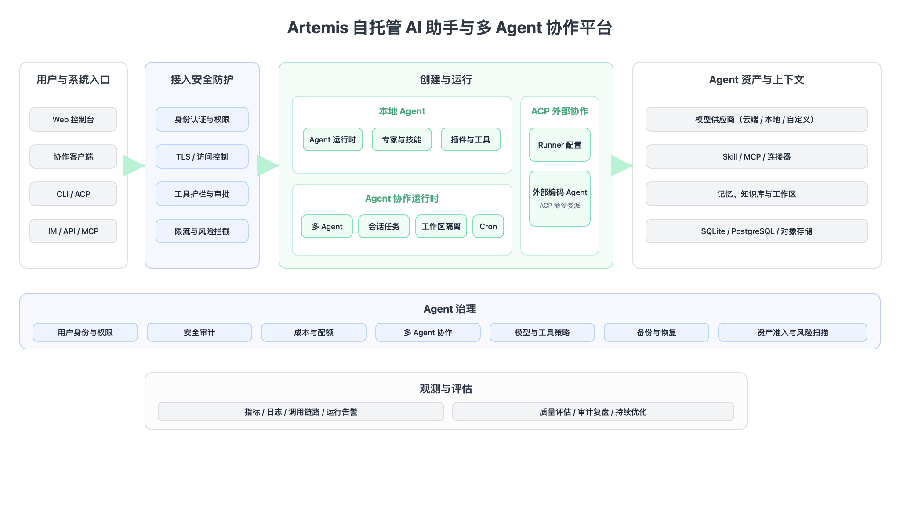

<p align="center">
  <strong>A smarter, self-hosted AI assistant — multi-user, multi-agent.</strong>
</p>

<p align="center">
  <a href="https://www.python.org/downloads/"></a>
  <a href="LICENSE"></a>
  <a href="https://pypi.org/project/artemis/"></a>
  <a href="https://github.com/astral-sh/ruff"></a>
  <a href="https://discord.gg/jPas5J8Ua"></a>
</p>

<p align="center">
  <a href="#-highlights">Highlights</a> ·
  <a href="#-overview">Overview</a> ·
  <a href="#-core-technology">Core Technology</a> ·
  <a href="#-features">Features</a> ·
  <a href="#-roadmap">Roadmap</a> ·
  <a href="#-quick-start">Quick Start</a> ·
  <a href="#-contents">Contents</a>
</p>

<p align="center">
  <b>English</b> · <a href="README_CN.md">中文</a>
</p>

---

**Artemis** is an open-source, self-hosted AI assistant. It's not just a tool — it's a digital life form that can operate in parallel. Through its multi-agent architecture, it builds an intelligent environment that is both independent and collaborative for teams, families, and individuals. Best of all, it runs entirely on your machine — the fully self-hosted design means privacy is never a compromise, while single-process startup makes the powerful web console, CLI, and IM integrations readily accessible.

Chat through the Web Dashboard, Feishu, DingTalk, QQ, Discord, WeCom, or programmatic HTTP/SSE/WebSocket. Extend capabilities with the **expert library**, **Connectors** (OAuth + MCP), and **ACP** integration for IDE workflows.

## ✨ Highlights

| | Feature | Description |
|---|---------|-------------|
| 👥 | **Multi-user expert team** | One admin, shared household; built-in expert library — switch specialists per scenario |
| 🎭 | **MBTI personas** | 16 personality templates plus an interactive quiz — give each agent a distinct character |
| 🔒 | **Security built-in** | JWT multi-user isolation, tool approval, shell command guardrails, and PII redaction — data stays local |
| 🔌 | **Connector ecosystem** | Tencent suite (Docs, Weibo trends, News, …); OAuth and MCP gateway extend resource boundaries |
| 💾 | **Pluggable backends** | Local disk, Docker containers, PostgreSQL, or COS/S3 — AI operates inside isolated boundaries |
| 🧠 | **Portable memory** | Powered by harness-memory; memory migrates with the workspace |
| 📚 | **Knowledge base** | RAG over your documents; semantic retrieval grounds agent answers in your private corpus |
| 🧩 | **Plugins** | Extend Artemis with third-party plugins; bundled plugins are seeded and toggled on demand |
| ↔️ | **ACP bidirectional** | `artemis acp` for IDE/terminal AI; delegate to OpenCode / Claude Code with permission gates |
| 💻 | **Terminal AI+** | Interactive shell in the browser — AI-assisted command execution and troubleshooting |
| 🌐 | **Browser AI+** | Headless Chromium sessions for web automation, screenshots, and remote browsing |
| 🖥️ | **Remote desktop** | Live screen and input from the dashboard on Linux, Windows, and macOS — remote office work and GUI apps; one-click isolated desktop on headless Linux |
| 🏠 | **Self-hosted** | Dashboard, CLI, IM channels, and cron in one `artemis run` — all data stays on your machine |

## 📌 Overview

Artemis is a self-hosted AI assistant platform for households and small teams. It runs a single process that serves a web dashboard, a CLI, IM channels (Feishu, DingTalk, QQ, Discord, WeCom, and more), and cron automation with SQLite by default and optional PostgreSQL support.

> Artemis's design goal: keep every conversation, workspace, and credential on your own machine, while giving each user a personal team of specialized agents they can switch between per task.

<details>
<summary>🐾 What can you do with Artemis</summary>

- **Personal assistant** — let a dedicated agent write weekly reports, organize notes, and manage your schedule; memory persists with the workspace.
- **Family sharing** — one admin account, the whole household; assign different agents and experts per member.
- **Team helper** — multiple agents collaborate in parallel, bridging Feishu / DingTalk / WeCom to route tasks into group chats.
- **Developer boost** — delegate coding tasks to OpenCode / Claude Code via ACP, or troubleshoot from the terminal with AI assistance.
- **Web automation** — use Browser AI+ to fill forms, capture screenshots, and gather public info.
- **Scheduled tasks** — configure cron in natural language so the agent pushes or runs jobs on time every day.

</details>

## 🧠 Core Technology

| Layer | Technology |
|-------|-----------|
| **Language** | Python 3.12+ |
| **Web framework** | FastAPI + uvicorn |
| **Agent runtime** | harness-agent |
| **Gateway** | harness-gateway |
| **Control plane DB** | SQLite (WAL, default) or PostgreSQL (optional) |
| **Frontend** | React 18 + TypeScript + Vite + Ant Design |
| **Scheduling** | APScheduler |
| **ACP** | agent-client-protocol |
| **Build / quality** | hatchling · ruff · mypy · pytest |

Artemis is built on the Harness stack — a set of focused runtimes that Artemis composes into one process:

- **harness-agent** — Agent runtime: model routing, tools, skills, and conversation checkpointing.
- **harness-gateway** — multi-platform IM channel bridge that normalizes incoming messages into a single processing pipeline.
- **harness-memory** — hierarchical recall with full-text search, so an agent's memory travels with its workspace.
- **harness-browser** — CDP-based browser automation with persistent profiles for web tasks.

Instead of an external queue or message broker, Artemis routes every surface — Web UI, IM, and cron — through one in-process `HarnessProcessor`. The result is a single, restart-safe process whose entire state is rebuilt from the control-plane database on boot (local SQLite by default; PostgreSQL optional).

## 🤔 Features

### Server & auth
- Multi-user JWT authentication with admin role
- First-run setup wizard (`artemis init`)
- Interactive API docs at `/api/docs` (off by default — set `"enable_api_docs": true` in `config.json` to enable)

### Agents
- Multiple agents per user; each has its own workspace, providers, channels, and cron
- 16 MBTI persona templates + custom system prompt
- Expert library scanned at boot (`infra/agents/experts/library/`)
- Workspace backends: local disk, COS, S3, and other remote stores

### Channels & automation
- IM channels: Feishu, DingTalk, QQ, Discord, WeCom, and more
- Proactive cron jobs with natural-language and slash-command triggers
- Unified message processing across Web UI, IM, and cron surfaces

### Surfaces
- **Web dashboard** — chat, agents, connectors, channels, cron, settings
- **CLI** — `artemis run`, `artemis chat`, `artemis acp`, admin commands
- **HTTP/SSE/WebSocket API** — full programmatic access

### Knowledge & plugins
- **Knowledge base** — RAG over your documents; upload files and let semantic retrieval ground agent answers in your private corpus
- **Plugins** — install and manage third-party plugins (`artemis plugin`); bundled plugins are seeded and toggled on demand from the dashboard

### ACP (Agent Client Protocol)

Artemis supports ACP in two directions:

1. **Inbound** — external tools use **your** Artemis agent
   ```bash
   artemis acp --agent main   # stdio ACP server for Zed, OpenCode, …
   ```

2. **Outbound** — Artemis delegates to external coding agents
   - Dashboard → **ACP** (`/acp`): configure runners (global per user)
   - Enable **acp_runner** per agent, then delegate in chat

Built-in outbound runners include OpenCode, CodeBuddy, Claude Code, and Codex.

Full setup: **[docs/acp.md](docs/acp.md)**.

## 🧭 Roadmap

Here are our mid-to-long term plans:

- [ ] **Shared resource pool** — a central pool of skills and sub-agents that any user can drop into a new expert without rebuilding from scratch.
- [ ] **Expert sharing** — publish your experts to other users in the same deployment, so good configurations are reused instead of recreated.
- [ ] **Browser & terminal polishing** — browser skill *recording* (capture a workflow and replay it as a skill) and a more capable terminal AI assistant.
- [ ] **AgentTeams** — let one coordinator autonomously schedule and orchestrate multiple experts to tackle multi-step tasks.
- [ ] **Self-evolution** — automatically distill everyday conversations into reusable skills, so the assistant grows with you.
- [ ] **PC / mobile clients** — native desktop and mobile apps alongside the web dashboard and IM channels.

This roadmap may shift as the community grows; treat it as indicative only.

## 🚀 Quick Start

### Prerequisites

- **macOS / Linux / Windows**
- No pre-installed Python required — the installer uses [uv](https://docs.astral.sh/uv/) to provision an isolated Python 3.12 environment under `~/.artemis/`
- Runtime configuration uses `ARTEMIS_*` environment variables; see [configuration](docs/configuration.md).
- A modern multi-core CPU with a few GB of RAM for the process plus model/embedding caches; enough disk for the database, agent workspaces, and document corpora

### 1. Install

**macOS / Linux** — one-line installer (recommended):

```bash
curl -fsSL https://finnie-1258344699.cos.ap-guangzhou.myqcloud.com/artemis/install.sh | bash
```

**Windows (PowerShell)**:

```powershell
irm https://finnie-1258344699.cos.ap-guangzhou.myqcloud.com/artemis/install.ps1 | iex
```

**Windows (cmd)** — download and run, or from a cloned repo:

```bat
curl -fsSL https://finnie-1258344699.cos.ap-guangzhou.myqcloud.com/artemis/install.bat -o install.bat
install.bat
```

After installation, open a **new terminal** or reload your shell:

```bash
source ~/.zshrc   # Zsh
# or
source ~/.bashrc  # Bash
```

The installer places `artemis` on your PATH. Optional extras:

```bash
# Browser automation (Playwright Chromium)
curl -fsSL https://finnie-1258344699.cos.ap-guangzhou.myqcloud.com/artemis/install.sh | bash -s -- --extras browser

# Feishu channel support
curl -fsSL https://finnie-1258344699.cos.ap-guangzhou.myqcloud.com/artemis/install.sh | bash -s -- --extras channels-feishu
```

See [scripts/README.md](scripts/README.md) for all install options (`--version`, `--from-source`, `--mirror`, Windows flags).

**Alternative — PyPI** (if you already manage Python yourself):

```bash
pip install artemis
# optional: pip install "artemis[browser]"
# optional local ONNX embedding model cache (Models → Local): pip install "artemis[local-embedding]"
# Downloads catalog weights for local use; not chat, not Memory.
```

From a source checkout with uv:

```bash
uv sync --extra local-embedding
```

### 2. Initialize

```bash
artemis init
```

The interactive wizard creates the SQLite database, JWT secret, and first admin account.

### 3. Run

```bash
# Foreground (API + Web dashboard)
artemis run

# Custom host / port
artemis run --host 0.0.0.0 --port 8088

# Register as a system service (systemd / launchd / Windows service)
artemis service start
```

Open **http://127.0.0.1:8088**. With Docker, first initialization generates a random admin password unless one is supplied. Interactive `artemis init` / the setup wizard asks you to choose a password (≥8 characters, letters and digits).

### Docker (recommended for production)

```bash
# Build and start
docker compose -f docker/docker-compose.yml up -d

# Or build manually
bash docker/docker_build.sh
docker run -d \
  -p 8088:8088 \
  artemis:latest
```

Open `http://localhost:8088`. First boot creates the admin account. Set the initial password through your deployment configuration or the setup wizard.

> **Password policy:** at least 8 characters with letters and digits.

See the deployment configuration for advanced runtime settings.

## 📑 Contents

- [Highlights](#-highlights)
- [Overview](#-overview)
- [Core Technology](#-core-technology)
- [Features](#-features)
- [Roadmap](#-roadmap)
- [Quick Start](#-quick-start)
- **Deploy & Use**
  - [Install options](#-install-options)
  - [Configuration](#-configuration)
  - [CLI reference](#-cli-reference)
  - [Web dashboard](#-web-dashboard)
  - [Data directory](#-data-directory)
- **Architecture & Dev**
  - [Architecture](#-architecture)
  - [Project layout](#-project-layout)
  - [Development](#-development)
- **Project Info**
  - [Security & privacy](#-security--privacy)
  - [Contributing](#-contributing)
  - [Changelog](#-changelog)
  - [Related projects](#-related-projects)
  - [License](#-license)

## 📦 Install options

| Method | Platform | Description |
|--------|----------|-------------|
| Remote one-liner | macOS / Linux | `curl …/artemis/install.sh \| bash` |
| Remote one-liner | Windows | `irm …/artemis/install.ps1 \| iex` or `install.bat` |
| Local script | macOS / Linux | `bash scripts/install.sh` |
| Local script | Windows | `scripts\install.bat` or `install.ps1` |
| PyPI | Any | `pip install artemis` or `pip install "artemis[browser]"` |
| Docker | Any | `docker/docker-compose.yml` |

All install scripts provision an isolated environment and do not touch system Python.

## ⚙️ Configuration

All runtime state is managed locally through the CLI and setup experience.

```bash
# LLM providers and models
artemis models
artemis provider list

# IM channels
artemis channel list
artemis channel install

# Skills (per agent)
artemis skills list --agent main

# Cron jobs
artemis cron list
artemis cron create --help

# Users (admin)
artemis user list
```

### Supported LLM providers

OpenAI-compatible APIs, DashScope (Qwen), Ollama, and other presets — configure per agent in the dashboard or via `artemis provider`.

### Supported channels

| Channel | Credentials |
|---------|-------------|
| **Feishu** | App ID, App Secret |
| **DingTalk** | App Key, App Secret |
| **QQ** | Bot AppID, Token |
| **Discord** | Bot Token |
| **WeCom** | Corp ID, Agent Secret |
| **Web Dashboard** | Enabled by default |

## 📖 CLI reference

| Command | Description |
|---------|-------------|
| `artemis init` | Bootstrap the local database, admin account, and JWT secret |
| `artemis run` | Start Artemis in the foreground |
| `artemis service start` | Install and start as a system service |
| `artemis service stop` | Stop the system service |
| `artemis agent` | Create, list, start/stop agents |
| `artemis channel` | Install and manage IM channels |
| `artemis chats` | REPL and session management |
| `artemis acp` | Stdio ACP server for IDE integration |
| `artemis cron` | Manage scheduled tasks |
| `artemis models` | Provider presets and model resolution |
| `artemis skills` | Enable/disable per-agent skills |
| `artemis plugin` | Install and manage third-party plugins |
| `artemis backup` | Export / restore backups |
| `artemis clean` | Remove CLI state or reset local application data |

Full reference: **[docs/cli.md](docs/cli.md)**.

## 🖥️ Web dashboard

After `artemis run`, open **http://127.0.0.1:8088**.

- **Chat** — real-time conversation with agents
- **Agents** — create agents, pick experts / MBTI personas, configure providers
- **Connectors** — OAuth apps and MCP gateways
- **Channels** — IM platform setup
- **Cron** — visual cron job management
- **Knowledge base** — manage document corpora and semantic retrieval
- **Plugins** — install, enable, and configure plugins
- **ACP** — configure outbound coding-agent runners
- **Settings** — users, security, TLS, system

Interactive API docs: **http://127.0.0.1:8088/api/docs** (disabled by default — enable by setting `"enable_api_docs": true` in `config.json`)

## 📁 Local data

Artemis keeps configuration, credentials, workspaces, logs, and local database state on the host. PostgreSQL is also supported through the setup wizard or configuration file. See [docs/configuration.md](docs/configuration.md) and [docs/adr/002-database-backends.md](docs/adr/002-database-backends.md).

See [docs/configuration.md](docs/configuration.md) for env vars and `config.json`.

## 🏗️ Architecture

Artemis brings together user entry points, security controls, local Agent runtime, external ACP collaboration, shared context, governance, and observability in one self-hosted system.

<p align="center">
  
</p>

```
ArtemisServer
 ├─ DatabasePool            SQLite (WAL) or PostgreSQL
 ├─ SharedServices       DI root — every repo + config
 ├─ ExpertCatalog        scans agents/experts/library/ at boot
 ├─ UserManager
 │   └─ HarnessAgentManager (per user)
 │       └─ AgentRuntime (per agent)
 │           ├─ HarnessAgent      Agent runtime (harness-agent)
 │           ├─ HarnessProcessor  IM / UI / cron entry point
 │           ├─ ChannelManager    IM connections (harness-gateway)
 │           └─ CronManager       APScheduler
 └─ FastAPI app (uvicorn)
```

Single process. Restart rebuilds state from the control-plane database (local SQLite by default; PostgreSQL optional).

See [docs/architecture.md](docs/architecture.md), [docs/adr/001-single-process-model.md](docs/adr/001-single-process-model.md), and [docs/adr/002-database-backends.md](docs/adr/002-database-backends.md).

## 📁 Project layout

```
src/artemis/
  config.py    env-var config
  launch.py    ArtemisServer boot + uvicorn
  infra/       business core (agents, gateway, cron, db, users, …)
  api/         HTTP layer — FastAPI app, routers, JWT, SSE
  cli/         CLI layer — Click commands
  dashboard/   built React SPA (wheel artifact)

dashboard/     frontend source (Vite) — edit here, run make build-frontend

docker/        Docker Compose, entrypoint, build & deploy scripts
tests/         unit/ + integration/
```

## 🛠️ Development

**Prerequisites:** Python 3.12+, Node 18+, [uv](https://docs.astral.sh/uv/)

```bash
# Backend
make install          # pip install -e ".[dev]"
make all              # format-all + lint + typecheck + test (ship bar)

# Frontend (separate terminal)
make dev-frontend     # Vite dev server on :5173 (override with VITE_DEV_PORT)
make build-frontend   # production build → src/artemis/dashboard/
cd dashboard && npx tsc --noEmit
```

Individual targets: `make test`, `make lint`, `make typecheck`, `make format`.

## 🔒 Security & privacy

- **Local-first**: Config, chats, workspaces, and credentials stay on your machine.
- **Multi-user isolation**: JWT auth with per-user agents and workspaces.
- **PII redaction & tool approval**: sensitive data is redacted before it leaves the workspace, and risky tools or shell commands require explicit approval under the guardrail rules.
- **Tool guardrails**: User-editable shell command rules protect risky operations.
- **No vendor lock-in**: Swap LLM providers, storage backends, and channels without rewriting agents.

## 🤝 Contributing

Contributions are welcome:

1. Fork the repository
2. Create a feature branch (`git checkout -b feature/amazing-feature`)
3. Run `make all` (backend) or `make check-all` (full stack) before submitting
4. Open a Pull Request

See [CONTRIBUTING.md](CONTRIBUTING.md) for the full guide. Security issues: [SECURITY.md](SECURITY.md).

Module boundaries and coding conventions: [AGENTS.md](AGENTS.md).

## 📋 Changelog

## 🔗 Related projects

| Project | Description |
|---------|-------------|
| harness-agent | Agent runtime — model routing, tools, skills, checkpointing |
| harness-gateway | Multi-platform IM channel bridge |
| harness-memory | Hierarchical recall and FTS search |
| harness-browser | CDP browser automation with persistent profiles |

> These `harness-*` projects are being prepared for open-sourcing; repository links will be added once they are published.

## 📄 License

This project is licensed under the [MIT License](LICENSE).
